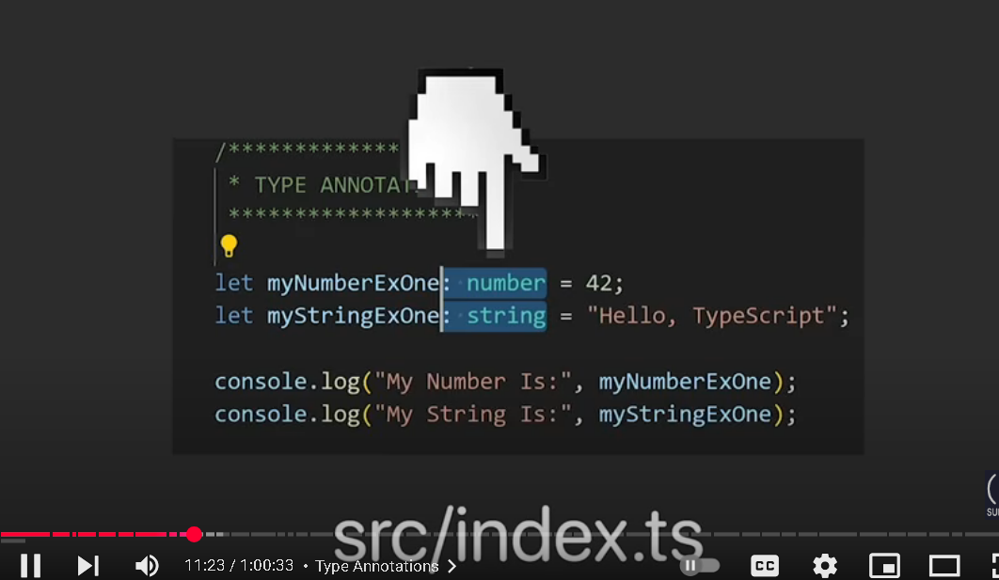
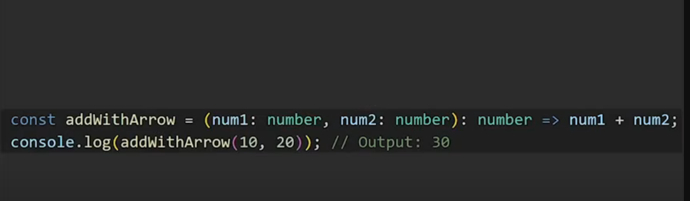
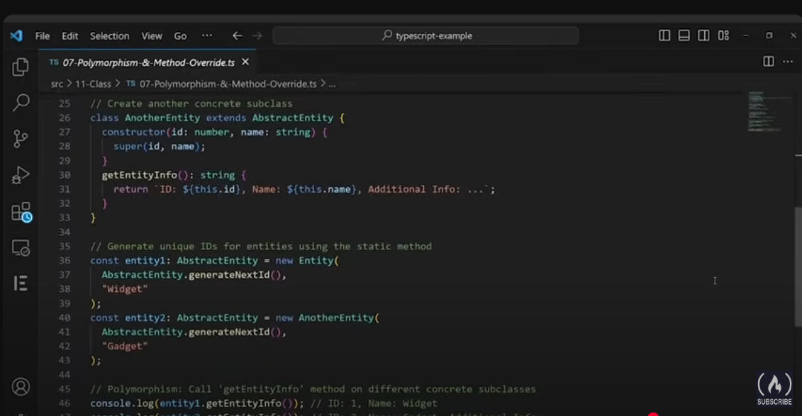

# TypeScript_Write_Maintable_JS_Code

- Typescript is Javascript with syntax for types
- Typescript is a superset of js that helps write better and maintainable JS code
- Typescript is all about typesafety
- Typescript is a programming languaga built on top of javascript .
- It enhances javascript by offering serveral features that aid in creating more robust and maintable application while reducing development time
- The most significant feature typescript provides is "static typing"

  

- Statically typed languages like C++ , Java , C#
  
  

- Typescript is Javascript with type checking ,It requires developers to explicitly specify variable types
- similiar to statically typed languages The typescript compiler code checks you code for type related errors at compile time itself
- catching many issues before runtime
- Even this helps you to identify and resolve error early in the development process
- You can use typescript in lot of domain from frontend to backend

- Why should we lean typescript?

- High Industry demand
- Simplification over JS code
- Efficiency
- Error prevention and Quick feedback (TypeScript detects errors before runtime providing instant feedback for faster and more reliable development
- Framework empowerment

- How typescript works ?

- 

- This is called as transpolation

- Setup
- Download vscode , nodejs (LTS) , verify node successfully installed by checking version node --version
- use node package manager to install typescript globally
- npm i -g typescript
- or
- npm install -g typescript
- after installation verify typescript by running tsc -v ( it should display the typescript version if its succesfully installed )

- create src folder and place index.ts into it
- create tsconfig.json file using the command tsc --init 
- Typescript will utilized the config defined inside the tsconfig.json while compiling using tsc (typescript compiler)

  
- Types in Typescript 

- Javascript JS comes with built in types such as numbers , boolean , string , null , undefined and objects
- Typescript extends these types by introducing types like any , unknown , never , enum and tuple to write robust js code

- Type Annotations : Are explicityly used to specify the type of the variable , function or any other entity
- Type Annotations are usually added using a colon (:) followed by the type 
- Ex: let name : string ;

- This makes it clear for both developers and typescript compiler about what type the variable takes or is allowed to take 
- keeping code robust , maintainable , less error prone and robust for other developers to easily understand

- any type means the variable can take any type it offs typescript type-checking for that variable or function (So avoid using any)

- Type Annotations with Objects 

- Type Annotations with objects allow you to specify the types of properties that an object must have

- Functions
  - Type Annotations with Function
  - Optional And Default parameter
  - Function Rest parameter
  - Arrow Function
  - Anonymous Function
  - void & never

Arrow Function

Anonymous function (IN TS and JS both same)

They are used when you need a small one more function without polluting the global scope with function name

- void and never

- Advanced types
  - Union Types 
  - Literal Types 
  - Nullable types
  - Type Alias
  - Intersection type

Union Types

Liertal Types 

Nullable Types

Type Alias 

Intersection Types 

- Array
  - Type Annotations with Arrays
  - Type Annotations with MultiDimensional Arrays

- Tuple

- Enums

- Enums in Typescript are a way to define a set of named constant values representing discrete options or categories
- Enums allow you to define a new date type composed of predefined defined values
- Enums start from 0 index

enum Direction {
  Up = "UP",
  Down = "DOWN",
  Left = "LEFT",
  Right = "RIGHT"
}

enum Direction {
  Up = 1,
  Down = 5,
  Left = 10,
  Right = 15
}

enum Direction {
  Up,       // 0
  Down,     // 1
  Left,     // 2
  Right     // 3
}

- Interface

Interfaces are widely in TS for defining the shape of the objects 

Interface reopening to extend to its existing functionalities

- Use Cases of Interfaces

1) Interface repening enables modular development allowing different parts of project to contribute
   interface defination

2) Progressive Enhancement: interfaces accomodate a new feature , this allows backward compatibily and code flexibility

3) Clear separation of concerns 

Built - In Interfaces

- TypeScript provides Built in interfaces for HTML elements

- Interfaces vs Types

- Class 
  - Class Type Annotations 
  - Class Access Modifiers
  - Class Accessors
  - Class Static Members 
  - Class Implement Interface
  - Abstract Classes and members
  - Polymorphism and Method Override

- In Typescript, a class is a blueprint for creating object with shared properties and methods. 
- It helps in defining and organization the structure of objects in your code 
- In Typescript Class Annotations specify the types of properties, method and constructor parameters within the class

- Class Access modifiers are used to control the visibility and accessibility of class members , properties  from outside the class 
- There are 3 main access modifiers 
  - member declared as public accessible anywhere from both within and outside the class
  - This is the default modifier if you dont explicitly specify one 
  
  

  - Private members declared are accessible only within the class
  - You cannot access private members outside the class
  
  

  - Protected members are accesible within the class and by all subclass that are inherited
  - You cannot access protected members from outside the class or unrelated classes
  
  

  - These access modifiers help you encapsulate the internal details of the class and provide a level of control over how
    class members are associated and manipulated

- Class Accessors (Getters and setters)

- Class Static members 
  - Static members or methods belong to the class itself rather than the object (instance of the class)
  - Meaning you can access them without creating a instance of the class 
  - They are defined using the "static" keyword

- Abstract Classes and members
  - Abstract classes are blueprints for other classes
  - They cannot be instantiated on their own but can be subclassed by othe subclasses
  - Abstract classes can contain abstract methods which are declared but not implemented in the abstract class itself
  - Subclasses are required to provide implementations for these abstract methods

Polymorphism and method overriding

Class vs Interface 

- A class is for creating an object
- while interface is for defining the shape of an object

Type Assertion 

- Means explicityly telling ts compiler to treat it as this type 

